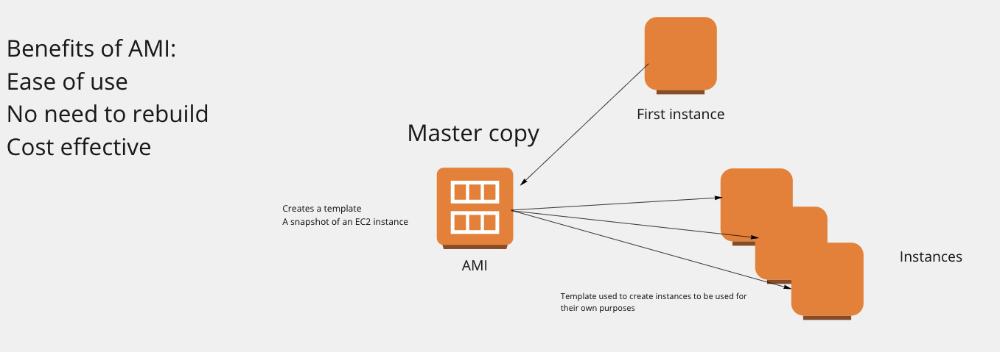

# Setting up an AMI
- Go to instances
- Select the instance you want to create an image of
- Select Actions > Image & Templates > Create Image
- Insert image name, description and tags
- Create - Tada!

#### Creating an instance from an AMI
- Go to AMI
- Select the AMI
- Select Launch instance from AMI
- Same procedures as setting up an EC2