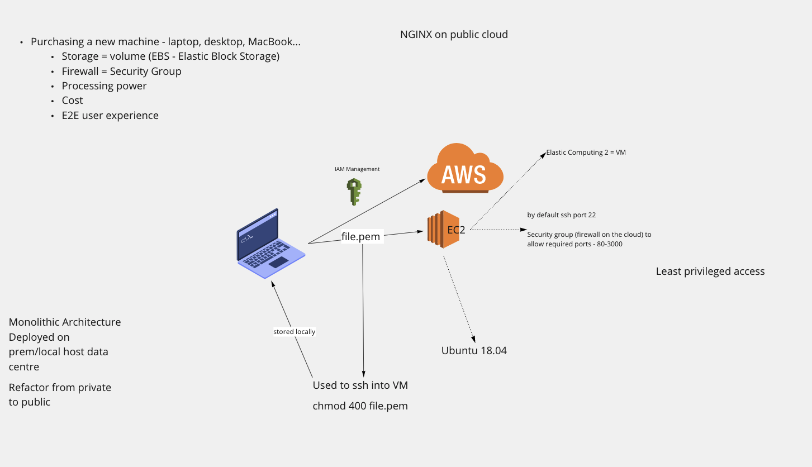

# Setting up access to a AWS VM (EC2)

- Move file.pem into .ssh folder
  - Located in home dir
- Type chmod 400 file.pem in bash terminal
  - Chmod 400 (chmod a+rwx,u-wx,g-rwx,o-rwx) sets permissions so that:
    - (U)ser / owner can read, can't write and can't execute
    - (G)roup can't read, can't write and can't execute
    - (O)thers can't read, can't write and can't execute.

## Setting up an EC2 (VM) on AWS

- Select EC2
- Select launch instance
  - Choose the launch instance option
- Select Ubuntu 18.04 (free tier)
- Select t2 micro, it's a 3 page app doesn't need much.
#### In configuring instance details select the following:
  - Number of Instance: 1
  - Default network
  - Select subnet default DevOpsStudent - default euw ending in 1a
  - Auto-assign public IP: Enable
#### No changes to Storage -  More than enough
- Add tag eng110_jack (So we know that it belongs to me)
#### Security Group:
  - Create a new Security Group
  - Name it "eng110_jack"
  - Give description
  - Two rules:
    - SSH with the source being 'My IP'
      - Give description (Office ip)
    - HTTP with source being 'Anywhere'
      - Give description "NGINX"
  - Review
#### Launch:
    - Choose existing key pair:
      - eng119 | RSA

## Connecting to EC2
- Click on instance
- Connect (top right)
- Click on SSH CLIENT
  - Copy the command example
- Open your git bash terminal:
  - `cd .ssh`
  - paste command
  - `sudo apt-get update -y`
  - `sudo apt-get upgrade -y`
  - `sudo apt-get install nginx -y`
- Go to your public IP (found on EC2 Instance connect)
- Post in url bar - Tada!

## Adding files from local host to EC2

- `scp -i location/file.pem -r destination/dir ec2@ip.com:source/file/or/folder`
  - SCP is secure file proxy
  - -i is identifier
  - pem location
  - -r receive
  - destination
  - Public DNS/ec2 id
  - source file or folder

#### App set up

- `cd starter-code/app` - Changes into the appropriate directory

- `sudo apt-get install software-properties-common -y` - Installs common-software-properties

- `curl -sL https://deb.nodesource.com/setup_12.x | sudo -E bash -` -
  Makes a curl request to https://deb.nodesource.com and downloads the specific nodejs version (in this case 12)

- `sudo apt-get install -y nodejs` -
  Installs the nodejs version requested with the above curl request

- `sudo apt-get update -y` - Updates

- `npm install` - Installs the dependencies

- `npm start &` - Runs npm in the background

#### Diagram of set up process:

  
#### Reverse proxy with NGINX

- In Security Groups, edit inbound rules
  - Custom TCP, set port range to 3000
- In /etc/nginx/sites-available/default:
  - `nano default` and add the following:
    - server_name your-ip;

        location / {
                # First attempt to serve request as file, then
                # as directory, then fall back to displaying a 404.
                try_files $uri $uri/ =404;
                proxy_pass http://localhost:3000;
        }

        location /fibonacci/ {
                proxy_pass http://localhost:3000/fibonacci/;
        }
- `npm start` - Tada!

#### Setting up a DB EC2

- Follow steps to set up an EC2 instance
- In Security Group add a rule to connect EC2s:
  - SSH - My IP
  - Custom TCP - Port Range 27017 (Mongodb default), Source 'insert EC2(app) Public IP/32'

#### Setting up MongoDB

- `sudo apt-key adv --keyserver hkp://keyserver.ubuntu.com:80 --recv 9DA31620334BD75D9DCB49F368818C72E52529D4` - The key for MongoDB
- `sudo add-apt-repository 'deb [arch=amd64] https://repo.mongodb.org/apt/ubuntu bionic/mongodb-org/4.0 multiverse'` - The version for MongoDB
- `sudo apt update -y`
- `sudo apt install mongodb-org -y` - Install the specified version of MongoDB
- `sudo systemctl start mongod`
- `sudo systemctl enable mongod`
- `mongo --eval 'db.runCommand({ connectionStatus: 1 })'` - Verify status/version
  - or `sudo systemctl status mongod`

#### Connecting App EC2 to DB EC2
- In the app EC2 app folder create an env variable DB_HOST
  - `export DB_HOST=mongodb://db-ip:27017/posts`
- `sudo node seeds/seed.js` - Finds, connects and seeds to DB
- `npm start` - Tada!

## Upon stopping and restarting the EC2s
- Repeat previous steps