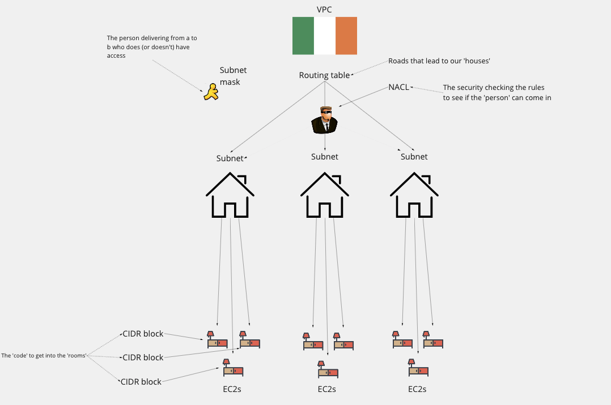

# Setting up a VPC

## Create VPC

- Search for and select VPC
- On left hand side select 'Your VPCs'
- Select the 'Create VPC' button
- Select the 'VPC Only' option
- Name/tags as per the naming convention
- In IPv4 CIDR define the value as '10.0.0.0/16'
- No IPv6
- Set 'Tenancy' to default
- Select 'Create VPC'

Isolated space in Ireland - empty, the address has been validated

## Create Internet gateway

- From the VCP dashboard
- Select 'Internet gateway' on left hand side
- Select 'Create internet gateway'
- Name/tags as per the naming convention
- Select 'Create internet gateway'

## Attach IG to VPC

- From Internet gateway select your IG
- From 'Actions' and select 'attach to VPC'
- Select your VPC
- Select 'Attach internet gateway'

## Creating a subnet

- Select 'Subnet' on left hand side
- Select 'Create subnet'
- Select your VPC
- Name/tags as per the naming convention
- Preference - no preference
- In IPv4 CIDR define the value as '10.0.3.0/24'

## Create route table

- Select 'Route table' on left hand side
- Select 'Create route table'
- Name/tags as per the naming convention
- Select your VPC
- Select 'Create route table'

## Connect route table with subnet

- From your Route select 'Routes' tab
- Select 'Edit routes'
- Select 'Add route'
  - Select 'Internet gateway' from drop down list
  - Define the value with '0.0.0.0/0' < Public use, public needs to access
- Select 'Save changes'

- Select the 'Subnet associations' tab
- Select 'Edit subnet associations'
- Select your subnet
- Select 'Save association'

### To add a private subnet route:

- Instance - your app
- Define the value with '0.0.0.0/0'

## Testing VPC

- EC2 Dashboard > AMIs
- Select your AMI
- Launch instance from AMI
- Go through the usual process
  - In networking select your VPC
- Connect to EC2

